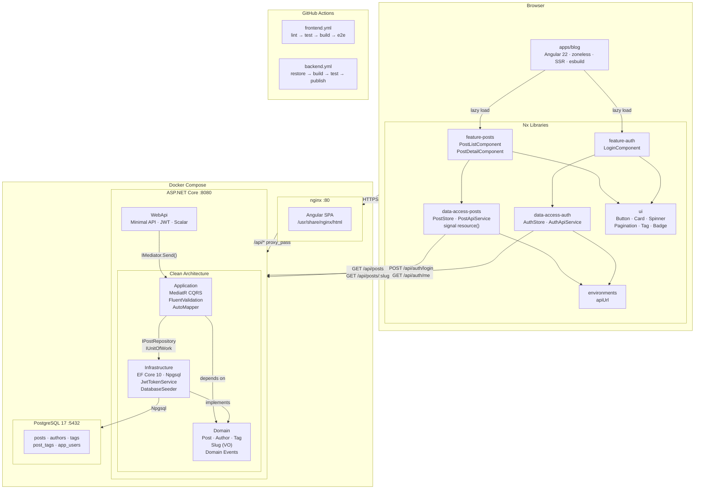
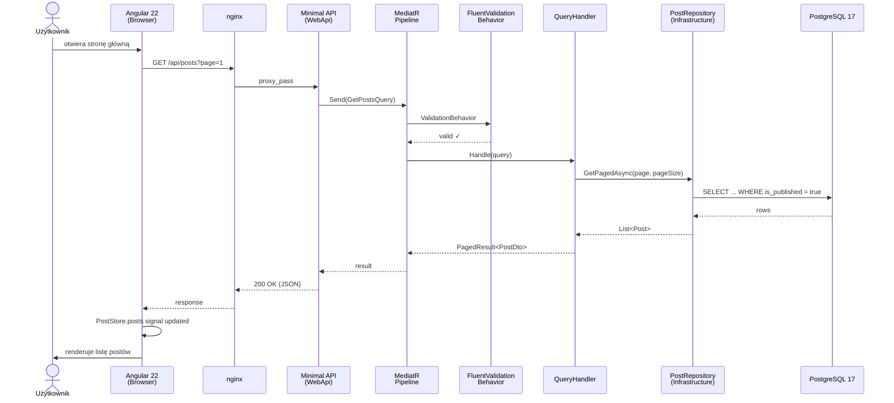

# TechBlog

[](https://sonarcloud.io/dashboard?id=Patryk-S-W_tech-blog)
[](https://stackshare.io/Patryk-S-W/tech-blog-frontend)
[](https://github.com/Patryk-S-W/tech-blog-frontend/actions/workflows/build.yaml)


The TechBlog project is a fullstack application written in the Angular and .NET that is used to publish articles related to technology, programming and topics related to artificial intelligence.

The repository is used as an orchestration layer for the whole project. The frontend and backend are kept as separate repositories and connected here through Git submodules.

## System requirements

- Node v22+ (see `frontend/.nvmrc`)
- Angular v21+
- .NET 10.0+

## Getting started

### Docker

```bash
git clone --recurse-submodules https://github.com/Patryk-S-W/tech-blog
cd tech-blog
cp .env.example .env
docker compose up --build
```

| Service          | URL                           |
| ---------------- | ----------------------------- |
| Frontend         | http://localhost:4200         |
| Backend API      | http://localhost:8080/api     |
| Swagger / Scalar | http://localhost:8080/swagger |
| Health check     | http://localhost:8080/health  |

### Development

```bash
# Frontend
cd frontend && npm i
npx nx serve blog          # dev server :4200
npx nx test blog           # vitest (unit)
npx nx e2e blog-e2e        # Playwright (e2e)
npx nx lint blog
npx nx graph               # dependency graph

# Backend
cd backend
dotnet run --project src/TechBlog.WebApi   # :8080
dotnet test                                 # tests

# EF Core — first migration
dotnet ef migrations add InitialCreate \
  --project src/TechBlog.Infrastructure \
  --startup-project src/TechBlog.WebApi
dotnet ef database update \
  --project src/TechBlog.Infrastructure \
  --startup-project src/TechBlog.WebApi
```

---

## Tech stack

| Layer               | Technology                            |
| --------------------- | -------------------------------------- |
| Frontend framework    | Angular 22 (standalone, zoneless, SSR) |
| Monorepo              | Nx 20                                  |
| Bundler               | esbuild                                |
| State management      | Signals + `resource()` API             |
| Styling               | SCSS + CSS custom properties           |
| Unit tests (frontend) | vitest-angular                         |
| E2E tests             | Playwright                             |
| Backend framework     | ASP.NET Core 10 Minimal API            |
| Architecture          | Clean Architecture                     |
| CQRS / mediator       | MediatR 12                             |
| Validation            | FluentValidation 11                    |
| Mapping               | AutoMapper 13                          |
| ORM                   | Entity Framework Core 10               |
| Database              | PostgreSQL 17 (Npgsql)                 |
| Auth                  | JWT Bearer                             |
| Hash                  | BCrypt.Net                             |
| Integration tests     | xUnit + Testcontainers.PostgreSql      |
| Assertions            | FluentAssertions                       |
| Mocking               | NSubstitute                            |
| Contenarization       | Docker Compose                         |
| CI/CD                 | GitHub Actions                         |

---


## Architecture



---

## Structure

```
tech-blog/                         ← umbrella repo
├── frontend/                      ← submodule → tech-blog-frontend
│   ├── apps/
│   │   ├── blog/                  ← Angular 22 app
│   │   │   ├── src/app/
│   │   │   │   ├── app.config.ts  ← zoneless, provideRouter, HttpClient
│   │   │   │   ├── app.routes.ts  ← lazy loading
│   │   │   │   ├── app.component.ts
│   │   │   │   └── core/auth/     ← interceptor, guard, token service
│   │   │   └── src/styles/        ← design tokens, reset, typography
│   │   └── blog-e2e/              ← Playwright tests
│   ├── libs/
│   │   ├── ui/                    ← Button, Card, Spinner, Pagination, Tag, Badge
│   │   ├── feature-posts/         ← PostListComponent, PostDetailComponent, PostCard
│   │   ├── feature-auth/          ← LoginComponent + authRoutes
│   │   ├── data-access-posts/     ← PostApiService, PostStore (signals + resource API)
│   │   ├── data-access-auth/      ← AuthApiService, AuthStore
│   │   └── environments/          ← apiUrl config
│   ├── nx.json
│   ├── Dockerfile                 ← multi-stage (builder → nginx)
│   └── nginx.conf
│
└── backend/                       ← submodule → tech-blog-backend
    ├── src/
    │   ├── TechBlog.Domain/       ← Post, Author, Tag, Slug (VO), domain events
    │   ├── TechBlog.Application/  ← CQRS queries/commands, behaviors, DTOs
    │   ├── TechBlog.Infrastructure/← EF Core, Npgsql, repositories, JWT, seeder
    │   └── TechBlog.WebApi/       ← Minimal API endpoints, middleware, Program.cs
    ├── tests/
    │   ├── TechBlog.Domain.Tests/        ← xUnit + FluentAssertions
    │   ├── TechBlog.Application.Tests/   ← xUnit + NSubstitute
    │   └── TechBlog.Infrastructure.Tests/← xUnit + Testcontainers (PostgreSQL)
    ├── TechBlog.sln
    └── Dockerfile                 ← multi-stage (sdk → aspnet runtime)
```

---

## Request flow



---

## Clean Architecture

```mermaid
graph LR
    subgraph DOMAIN["Domain (jądro — zero zależności)"]
        E["Entities\nPost · Author · Tag"]
        VO["Value Objects\nSlug"]
        DE["Domain Events\nPostPublishedEvent"]
        I["Interfaces\nIPostRepository\nITagRepository\nIUnitOfWork"]
    end

    subgraph APP["Application (zależy tylko od Domain)"]
        Q["Queries\nGetPostsQuery\nGetPostBySlugQuery"]
        C["Commands\nCreatePostCommand\nUpdatePostCommand\nDeletePostCommand"]
        B["MediatR Behaviors\nValidationBehavior\nLoggingBehavior"]
        DTO["DTOs + AutoMapper\nPostDto · AuthorDto · TagDto"]
    end

    subgraph INFRA["Infrastructure (implementacje)"]
        CTX["TechBlogDbContext\nEF Core 10 · Npgsql"]
        REPO["Repositories\nPostRepository\nTagRepository"]
        JWT["JwtTokenService"]
        SEED["DatabaseSeeder"]
    end

    subgraph WEB["WebApi (wejście)"]
        EP["Endpoints\nPostsEndpoints\nAuthEndpoints\nTagsEndpoints"]
        MW["Middleware\nExceptionHandling"]
        EXT["Extensions\nJWT Auth\nCORS · Health"]
    end

    APP -->|"IPostRepository\nIUnitOfWork"| DOMAIN
    INFRA -->|"implements"| DOMAIN
    INFRA -->|"implements"| APP
    WEB -->|"IMediator.Send()"| APP
    WEB -.->|"nie zależy bezpośrednio"| DOMAIN
    WEB -.->|"nie zależy bezpośrednio"| INFRA
```



## License

MIT License

Copyright (c) 2024-2026 Patryk Sadowski

Permission is hereby granted, free of charge, to any person obtaining a copy
of this software and associated documentation files (the "Software"), to deal
in the Software without restriction, including without limitation the rights
to use, copy, modify, merge, publish, distribute, sublicense, and/or sell
copies of the Software, and to permit persons to whom the Software is
furnished to do so, subject to the following conditions:

The above copyright notice and this permission notice shall be included in all
copies or substantial portions of the Software.

THE SOFTWARE IS PROVIDED "AS IS", WITHOUT WARRANTY OF ANY KIND, EXPRESS OR
IMPLIED, INCLUDING BUT NOT LIMITED TO THE WARRANTIES OF MERCHANTABILITY,
FITNESS FOR A PARTICULAR PURPOSE AND NONINFRINGEMENT. IN NO EVENT SHALL THE
AUTHORS OR COPYRIGHT HOLDERS BE LIABLE FOR ANY CLAIM, DAMAGES OR OTHER
LIABILITY, WHETHER IN AN ACTION OF CONTRACT, TORT OR OTHERWISE, ARISING FROM,
OUT OF OR IN CONNECTION WITH THE SOFTWARE OR THE USE OR OTHER DEALINGS IN THE
SOFTWARE.