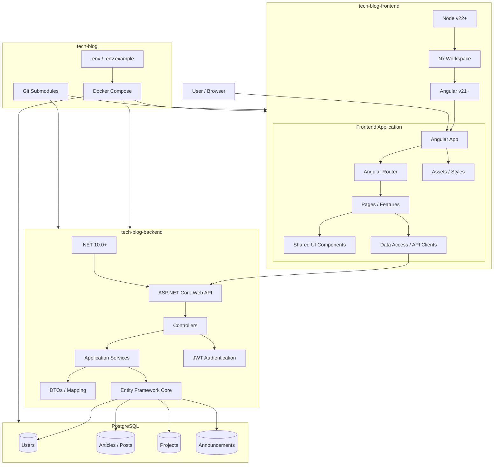
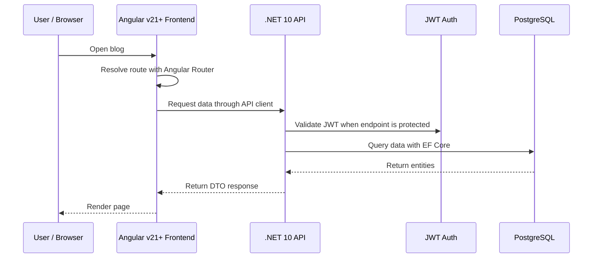
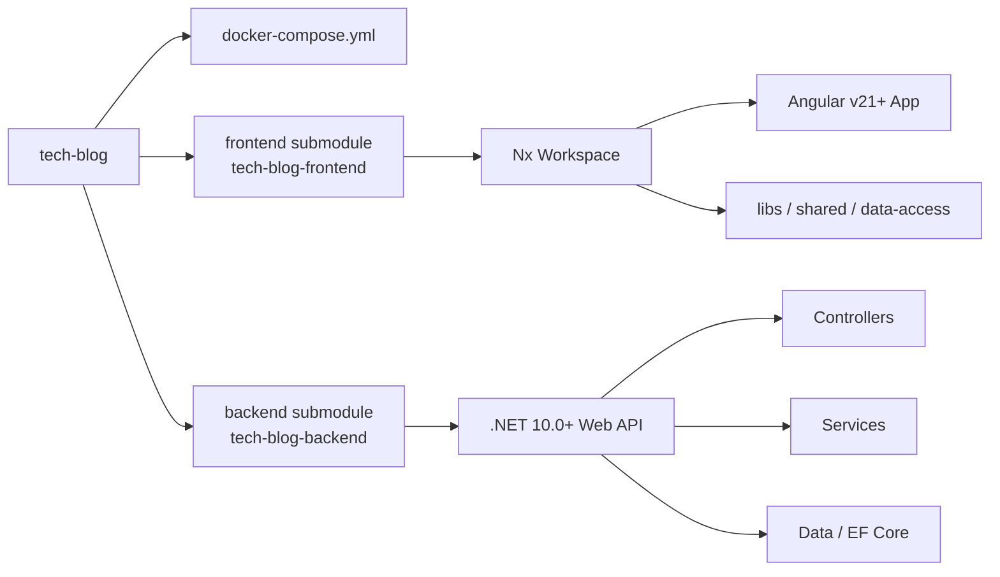

# TechBlog


[](https://sonarcloud.io/dashboard?id=Patryk-S-W_tech-blog-frontend)
[](#contributors-)

[](https://stackshare.io/Patryk-S-W/tech-blog-frontend)


The TechBlog project is a fullstack application written in the Angular and .NET that is used to publish articles related to technology, programming and topics related to artificial intelligence.

The repository is used as an orchestration layer for the whole project. The frontend and backend are kept as separate repositories and connected here through Git submodules.

## System requirements

- Node v22+ (see `frontend/.nvmrc`)
- Angular v21+
- .NET 10.0+

## Getting started

```bash
git clone --recurse-submodules https://github.com/Patryk-S-W/tech-blog
cd tech-blog
docker compose up
```

Frontend: http://localhost:4200  
Backend API: http://localhost:8080/api  
Swagger: http://localhost:8080/swagger

## Architecture



## Runtime Flow



## Repository Layout



## License

MIT License

Copyright (c) 2024-2026 Patryk Sadowski

Permission is hereby granted, free of charge, to any person obtaining a copy
of this software and associated documentation files (the "Software"), to deal
in the Software without restriction, including without limitation the rights
to use, copy, modify, merge, publish, distribute, sublicense, and/or sell
copies of the Software, and to permit persons to whom the Software is
furnished to do so, subject to the following conditions:

The above copyright notice and this permission notice shall be included in all
copies or substantial portions of the Software.

THE SOFTWARE IS PROVIDED "AS IS", WITHOUT WARRANTY OF ANY KIND, EXPRESS OR
IMPLIED, INCLUDING BUT NOT LIMITED TO THE WARRANTIES OF MERCHANTABILITY,
FITNESS FOR A PARTICULAR PURPOSE AND NONINFRINGEMENT. IN NO EVENT SHALL THE
AUTHORS OR COPYRIGHT HOLDERS BE LIABLE FOR ANY CLAIM, DAMAGES OR OTHER
LIABILITY, WHETHER IN AN ACTION OF CONTRACT, TORT OR OTHERWISE, ARISING FROM,
OUT OF OR IN CONNECTION WITH THE SOFTWARE OR THE USE OR OTHER DEALINGS IN THE
SOFTWARE.
